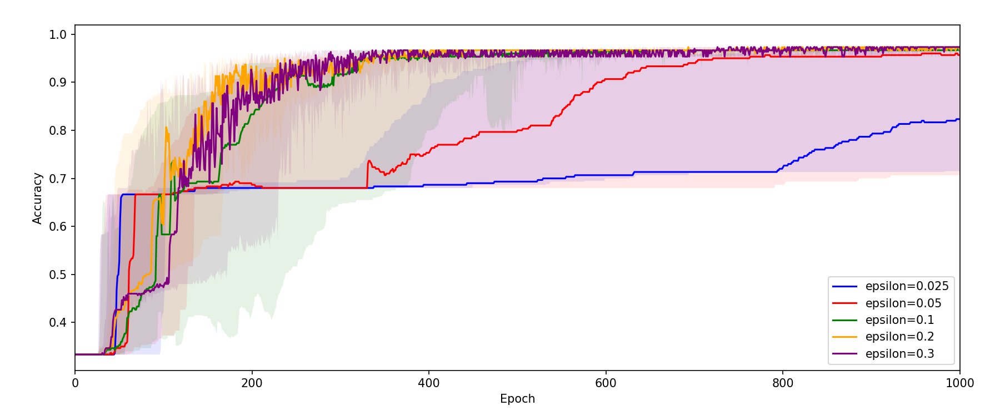
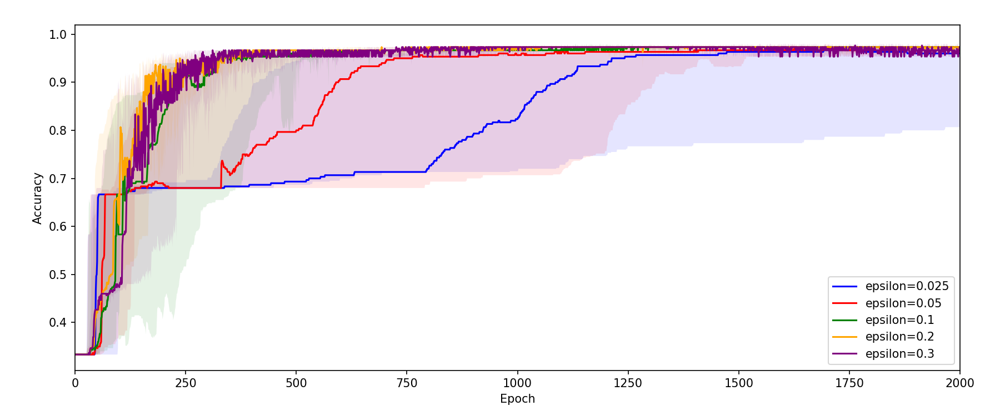
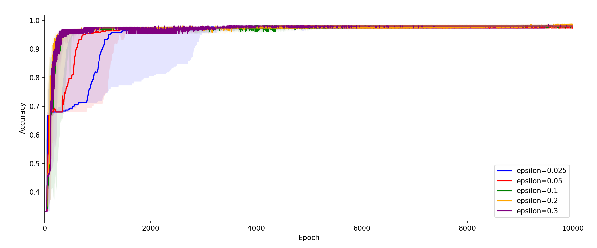
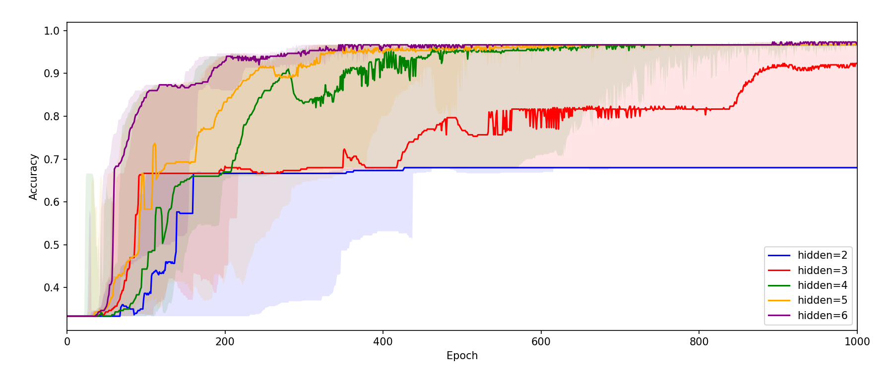
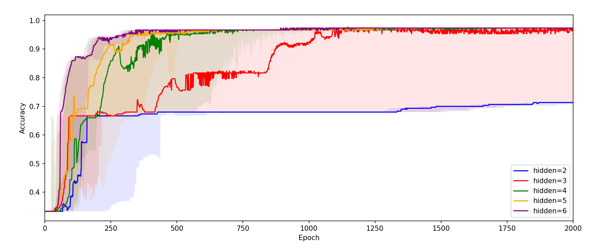
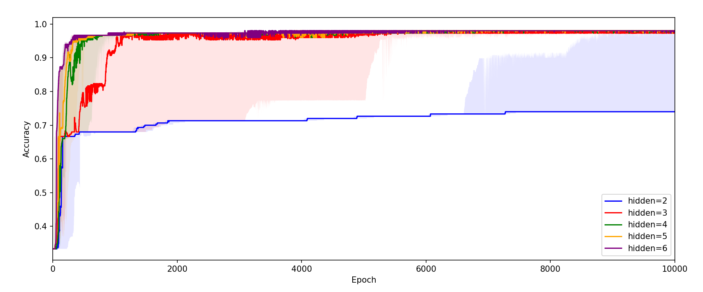

# Neural-Network

3-layer Neural-Network (NN) written with Python 3

---

## Structure

| Name              | Number    | Example in ***iris dataset*** |
| --                | --        | --                            |
| hidden layer      | 1         | 1                             |
| total layer       | 3         | 3                             |
| input layer node  | arbitrary | 4                             |
| hidden layer node | arbitrary | 1, 2, ...                     |
| output layer node | arbitrary | 3                             |

## Preliminary 

This program requires modules below:

- numpy
- pandas
- matplotlib
- sklearn (scikit-learn)
- joblib (if you want to parallel ***trials***)

Here, ***iris dataset*** in *scikit-learn* is used as an example

> TASK: **to predict the kinds of iris** (***setosa, versicolour, virginica***) **using information** (***sepal width, sepal length, petal width, petal length***) 

## Python files

to run NN

| File name             | Class         | Explanation                           |
| --                    | --            | --                                    |
| `main.py`             | (None)        | to run NN                             |
| `neural_network.py`   | NN            | program body                          |
| `configuration.py`    | Configuration | to set hyperparameters and dataset    |
| `logger.py`           | Logger        | to export log                         |

to summarize and compare results collected while changing hyperparameters(e.g., learning rate $\epsilon$ and the number of hidden layer)

| File name             | Class         | Explanation                           |
| --                    | --            | --                                    |
| `summarizer.py`       | Summary       | to summarize and compare              |
| `config_sum.py`       | Configuration | to select data and color to use       |

## Output and folders and files

exported by `logger.py`

| Name                          | Folder/File   | Explanation                                                                   |
| --                            | --            | --                                                                            |
| `trial`                       | Folder        | where result of each trial stored (values of nodes, prediction probability)   |
| `all_trials.csv`              | File          | accuracy of classification of each epochs in each trial                       |
| `experimental_setting.txt`    | File          | log of configuration                                                          |
| `statistics.csv`              | File          | *min, q25, med, q75, max, ave, std of accuracy of whole trials                |

exported by `summarizer.py`

| Name                          | Explanation                                                       |
| --                            | --                                                                |
| `all_trials.csv`              | accuracy of classification of each epochs in each trial           |
| `experimental_setting.txt`    | log of configuration                                              |
| `statistics.csv`              | *min, q25, med, q75, max, ave, std of accuracy of whole trials    |

---

## Examples

#### Comparison of accuracies when changing learning-rate $\epsilon$

(the number of hidden layer $= 5$ in common)

epoch = 1,000 :

epoch = 2,000 :

epoch = 10,000 :

#### Comparison of accuracies when changing the number of hidden layer

(learning-rate $\epsilon = 0.1$ in common)

epoch = 1,000 :

epoch = 2,000 :

epoch = 10,000 :

